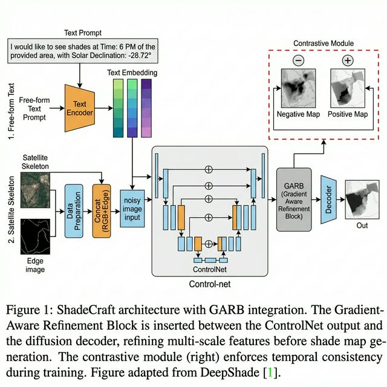

# ShadeCraft: Learning Time-Dynamic Urban Shadow Patterns with Deep Generative Models

[](ShadeCraft.pdf)
[](https://arxiv.org/abs/2507.12103)
[](https://huggingface.co/datasets/DARL-ASU/DeepShade)
[](https://engineering.asu.edu)

> **Replicating and improving the DeepShade diffusion framework for high-resolution shade simulation in hot-arid cities, augmented with a Gradient-Aware Refinement Block (GARB) for sharper, more geometrically accurate shadow boundaries.**

**Authors:** Vraj Chaudhari · [Tejas Uttare](https://github.com/Pegasus1106) · Atharva Shirode · Austin Jones  
*Ira A. Fulton Schools of Engineering, Arizona State University*

---

## 🏗️ Architecture



**Figure 1: ShadeCraft architecture with GARB integration.**  
The **Gradient-Aware Refinement Block (GARB)** is inserted between the ControlNet output and the diffusion decoder, refining multi-scale features before shade map generation. The contrastive module (right) enforces temporal consistency during training.

---

## 📄 Abstract

Urban heat exposure is a growing public-health concern in hot-arid regions, where limited vegetation and dense built environments intensify surface temperatures. DeepShade [1] — a diffusion-based, text-conditioned framework — offers a notable step forward by integrating satellite imagery, OpenStreetMap building geometries, and 3D simulation pipelines to generate time-aware shade maps. However, the generated shade lines often show **softened boundaries and minor geometric misalignment**, reflecting limitations in the current ControlNet-based conditioning.

In this project, we replicate the DeepShade pipeline and introduce a lightweight architectural improvement to enhance boundary precision. Drawing inspiration from structural refinement modules in ShadowGAN [9] and Deep Umbra [5], we incorporate a **Gradient-Aware Refinement Block (GARB)** following the ControlNet backbone. This block fuses multi-scale gradient features derived from both the input edge image and the intermediate latent representation, enabling the model to better preserve high-frequency shadow contours and building outlines.

Our experimental evaluation on the DeepShade Tempe dataset demonstrates that GARB achieves a **27.11% relative improvement in Boundary IoU (B-IoU)** and a **5.86% improvement in mean Intersection over Union (mIoU)** compared to the baseline model.

---

## 🆕 Our Key Improvement: GARB (Gradient-Aware Refinement Block)

The core limitation of DeepShade is that ControlNet latents are passed directly to the decoder without any boundary-aware refinement, leading to blurry shadow edges.

**ShadeCraft inserts GARB between the ControlNet output and the diffusion decoder.**

### GARB Architecture

```
ControlNet Output Features
         │
   ┌─────▼──────────────┐
   │   Edge Projection   │  ← Normalizes hint image → feature space
   │  (Conv + SiLU)      │    Channels: 320 → 640 → 1280
   └─────┬──────────────┘
         │
   ┌─────▼──────────────┐
   │  Refinement Block   │  ← Concatenates projected edge features
   │  (3-layer CNN)      │    with ControlNet features
   │  Zero-initialized   │    Zero-init final layer = identity start
   └─────┬──────────────┘
         │
   ┌─────▼──────────────┐
   │  Gated Residual     │  ← Learned sigmoid gate (~12% contribution)
   │  Connection         │    Adaptively controls refinement strength
   └─────┬──────────────┘
         │
   Refined Features ──► Decoder ──► Shade Map
```

### Why Each Component Matters

| GARB Component | Purpose |
|---|---|
| **Edge Projection** | Projects input building outlines into the latent feature space at multiple scales (320, 640, 1280 channels) using Conv + SiLU layers |
| **Refinement Block (3-layer CNN)** | Fuses projected edge features with ControlNet features; zero-initialized final layer ensures training stability (starts as identity) |
| **Gated Residual Connection** | Learned sigmoid gate (~12% contribution) adaptively controls how much refinement is applied — prevents over-correction |

### What Problem GARB Solves

| Problem in DeepShade | GARB Fix |
|---|---|
| Blurry, softened shadow boundaries | Explicit gradient/edge supervision sharpens contours |
| Geometric misalignment at building edges | Multi-scale feature fusion aligns shadows with outlines |
| Decoder receives raw, unrefined latents | GARB refines latents before decoding |

---

## 📊 Results

**Table 1: Quantitative comparison on the Tempe, AZ test set (877 samples)**

| Metric | Baseline (DeepShade) | ShadeCraft + GARB | Δ Change |
|---|---|---|---|
| **SSIM ↑** | 0.9697 | 0.9688 | −0.09% |
| **MSE ↓** | 18.17 | 17.74 | **−2.34%** ✅ |
| **mIoU ↑** | 0.2889 | 0.3059 | **+5.86%** ✅ |
| **B-IoU ↑** | 0.0774 | 0.0983 | **+27.11%** ✅ |
| **LPIPS ↓** | 0.2692 | 0.3321 | +23.34% ⚠️ |

### What the Numbers Mean

- ✅ **B-IoU +27.11%** — The most important metric: shadow boundary precision improved dramatically. GARB correctly aligns shadow edges with building outlines.
- ✅ **mIoU +5.86%** — Overall shadow region accuracy improved, meaning GARB produces more geometrically correct shade coverage.
- ✅ **MSE −2.34%** — Lower pixel-level error.
- ⚠️ **LPIPS +23.34%** — Slight increase in perceptual noise. GARB introduces additional high-frequency texture detail; this is a known tradeoff when optimizing for boundary sharpness over perceptual smoothness. For urban heat analysis, geometric fidelity (B-IoU, mIoU) is the critical metric.
- **SSIM essentially unchanged** — Global structural similarity is maintained.

> 🔬 These results suggest that targeted architectural refinements — without retraining the full diffusion backbone — can significantly improve the fidelity of urban shade simulations for climate-resilient urban planning.

---

## 🌍 Background & Motivation

Urban heat exposure poses a growing challenge in hot-arid cities like **Tempe, Arizona**, where sparse vegetation and dense built forms intensify surface temperatures and reduce pedestrian comfort. Accurate shade representation is critical for:

- **Heat-resilient pedestrian routing** — routes that minimize sun exposure
- **Urban planning** — identifying areas that need more shade infrastructure
- **Public health** — predicting heat-risk zones under extreme temperatures

Existing tools fail because:
- Satellite imagery is noisy and shadows are hard to isolate
- Time-of-day shadow dynamics require large, well-labeled datasets
- Generative models often produce blurry, geometrically inaccurate results

**ShadeCraft** addresses the last point directly by sharpening boundary precision with GARB.

---

## 📦 Repository Structure

```
ShadeCraft/
├── ControlNet/                              # Core model code
│   ├── run_vanillaControlnet_train_dlc.py   # Training entry point
│   ├── cldm/                                # ControlNet model (cldm.py, ddim_hacked.py)
│   ├── ldm/                                 # Latent Diffusion Model backbone
│   ├── annotator/                           # Edge detectors (Canny, HED, MLSD, etc.)
│   ├── a_inference/                         # Inference & analysis
│   │   ├── infer_single.py                  # Single-image inference
│   │   ├── evaluate_grey.py                 # Evaluation metrics
│   │   └── analyze.ipynb                    # Shade feature analysis notebook
│   └── models/                              # Model weights (not tracked — too large)
├── dataset/                                 # Data (not tracked — use links below)
│   └── Tempe/                               # Tempe, AZ subset
├── docs/
│   └── architecture_garb.png                # Architecture diagram
├── ShadeCraft.pdf                           # Full project report
├── requirements.txt                         # Python dependencies
└── README.md                                # This file
```

---

## 📂 Dataset

| Dataset | Link | Samples |
|---|---|---|
| **Toy Dataset** (quick start) | [Google Drive](https://drive.google.com/file/d/1tkSzr3WZfflo4fQDpYdr4FXSiiEbi1Pg/view?usp=sharing) | Small subset |
| **Full DeepShade Dataset** | [Hugging Face – DARL-ASU/DeepShade](https://huggingface.co/datasets/DARL-ASU/DeepShade) | Full dataset |

**Tempe subset used in this project:**
- Training: 2,048 samples (70%)
- Testing: 877 samples (30%)

Each sample includes:
- `source`: satellite + edge image (RGB + Edge concatenated)
- `target`: ground-truth shade map
- `prompt`: text conditioning (e.g. `"Time: 6 PM, Solar Declination: -28.72°"`)

**Setup:**
```bash
# Download toy dataset from Google Drive, then:
unzip toy_dataset.zip -d dataset/

# Or download full Tempe subset via Hugging Face:
huggingface-cli download DARL-ASU/DeepShade --local-dir dataset/
```

> ⚠️ After downloading, update the JSON file `source`/`target` paths to match your local directory (replace the placeholder username with your own path).

---

## 🚀 Usage

### Prerequisites

```bash
# Clone this repo
git clone https://github.com/Vr978/ShadeCraft.git
cd ShadeCraft

# Create virtual environment
python -m venv venv
source venv/bin/activate        # macOS/Linux

# Install dependencies
pip install -r requirements.txt
```

### Train the Model

```bash
python ControlNet/run_vanillaControlnet_train_dlc.py
```

> Update the dataset JSON path inside the training script to point to your local data before running.

### Inference on a Single Image

```bash
python ControlNet/a_inference/infer_single.py
```

### Evaluate on Test Set

```bash
python ControlNet/a_inference/evaluate_grey.py
```

### Analyze Shade Features

```bash
jupyter notebook ControlNet/a_inference/analyze.ipynb
```

---

## 🔧 Key Configuration Parameters

| Parameter | Description | Default |
|---|---|---|
| `learning_rate` | Optimizer LR | `1e-5` |
| `batch_size` | Training batch size | `4` |
| `sd_locked` | Freeze Stable Diffusion weights | `True` |
| `only_mid_control` | Train only mid-block control | `False` |

---

## � Acknowledgements

We extend our sincere gratitude to:

- **Longchao Da, Xiangrui Liu, Mithun Shivakoti, Thirulogasankar Pranav Kutralingam, Yezhou Yang, and Hua Wei** — the authors of **DeepShade** ([arXiv:2507.12103](https://arxiv.org/abs/2507.12103)), whose open-source framework and dataset formed the foundation of this project. ShadeCraft is built directly on top of their work and would not exist without it.

## 👥 Contributors

| Name | GitHub |
|---|---|
| Vraj Chaudhari | [@Vr978](https://github.com/Vr978) |
| Tejas Uttare | [@Pegasus1106](https://github.com/Pegasus1106) |
| Atharva Shirode | — |
| Austin Jones | — |

- **The Sol Supercomputer Team at ASU** — for providing the computational resources necessary to train the baseline model.

- **ControlNet** (Zhang et al.) and **Stable Diffusion** (Rombach et al.) for the underlying diffusion architecture.

---

## 📖 Citation

If you use this work, please cite the original DeepShade paper that this project builds upon:

```bibtex
@article{da2025deepshade,
  title={Deepshade: Enable shade simulation by text-conditioned image generation},
  author={Da, Longchao and Liu, Xiangrui and Shivakoti, Mithun and Kutralingam, Thirulogasankar Pranav and Yang, Yezhou and Wei, Hua},
  journal={arXiv preprint arXiv:2507.12103},
  year={2025}
}
```

---

## � License

This project builds on the DeepShade codebase. See [LICENSE](ControlNet/LICENSE) for the original license terms.